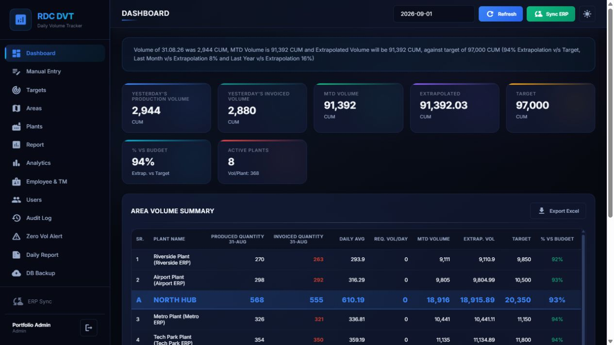
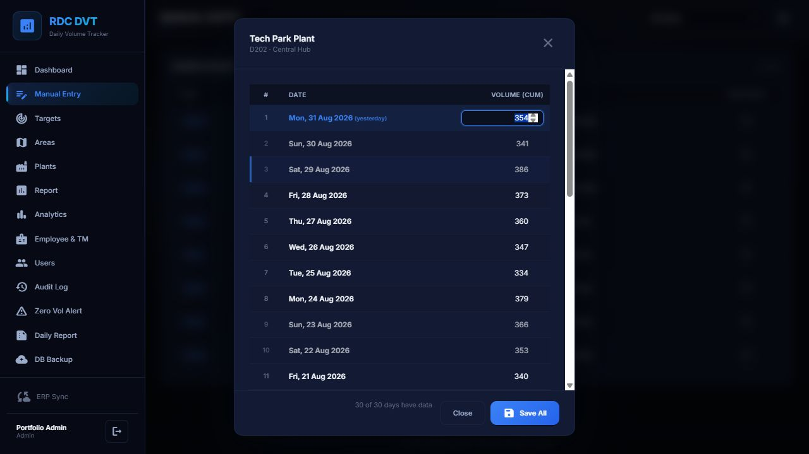
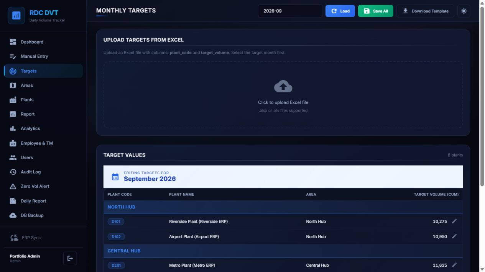
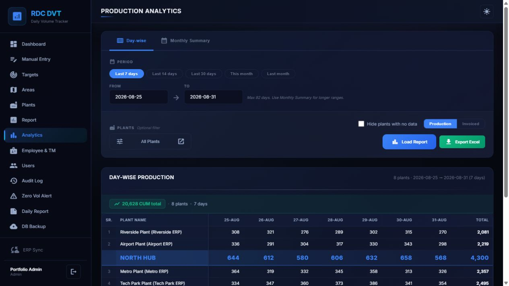
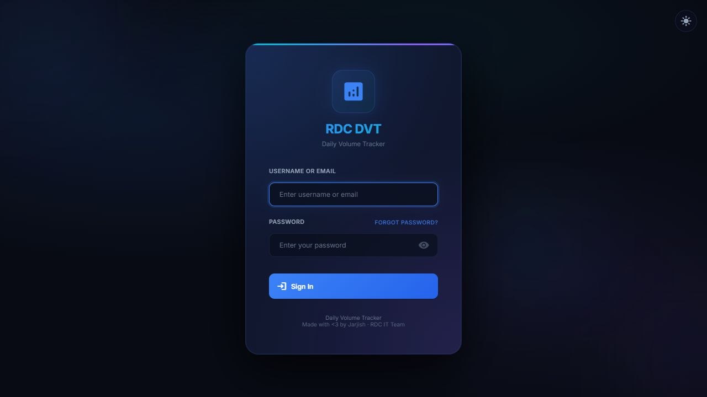
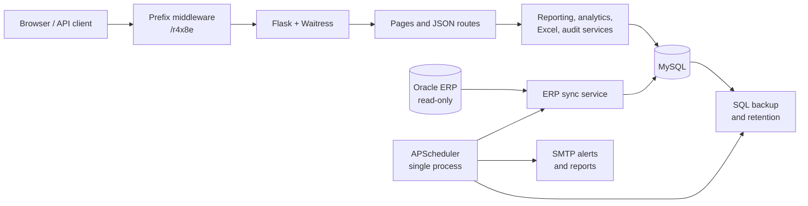

# RDC Daily Volume Tracker

[](https://github.com/jarjishSiddibapa/rdc-daily-volume-tracker/actions/workflows/ci.yml)
[](https://www.python.org/)
[](https://flask.palletsprojects.com/)
[](https://www.mysql.com/)
[](https://docs.pylonsproject.org/projects/waitress/)

An operations-focused web application for tracking ready-mix concrete production across plants and regions. RDC DVT brings ERP-synchronized and manually entered volumes into one fast dashboard, then adds target planning, variance analysis, Excel reporting, role-based access, operational alerts, audit history, and automated backups.

> Built as a production-oriented internal tool: server-rendered, dependency-light in the browser, conservative on shared-server resources, and documented for repeatable deployment and operation.



*Current interface shown with a fictional portfolio dataset created only for documentation. No production data or credentials are included.*

## Why this project exists

Daily production reporting often spans ERP data, manual plant updates, spreadsheets, and follow-up messages. RDC DVT turns those disconnected steps into one controlled workflow:

- one daily view across plants, areas, targets, and historical comparisons;
- a manual fallback for plants or dates that cannot be synchronized;
- repeatable analytics and Excel exports instead of hand-built reports;
- scheduled alerts, reports, ERP synchronization, and database backups;
- access controls and audit records for operational accountability.

## Capabilities

| Area | What the application provides |
| --- | --- |
| **Daily visibility** | Produced and invoiced KPIs, plant and area subtotals, month-to-date progress, target attainment, and previous-month/year comparisons |
| **Data collection** | Read-only Oracle ERP synchronization every 30 minutes, manual daily entry, and a 30-day correction workflow |
| **Planning** | Monthly plant targets, inline editing, Excel target upload, plant/area organization, and display ordering |
| **Analytics** | Day-wise and monthly views, produced/invoiced switching, plant filtering, quick date ranges, and formatted Excel exports |
| **People & ownership** | Employee and territory-manager details connected to operational reporting |
| **Automation** | Configurable zero-volume alerts, scheduled daily-report emails, local SQL backups, retention controls, and retry-safe job checks |
| **Administration** | Admin, manual-entry, and viewer roles; plant-scoped access; optional target/employee permissions; active-user controls; audit logs |
| **Integration API** | Short-lived Bearer tokens and read-only daily, monthly, and yearly volume endpoints |

## Product tour

### Correct a full month without leaving the page

The manual-entry workspace supports quick single-day updates and a focused 30-day editor. Authorized users see only the plants assigned to them.



### Plan targets in the UI or import them from Excel

Administrators and explicitly authorized operators can maintain monthly targets inline or upload the provided workbook format.



### Move from summary KPIs to day-level analysis

Analytics supports quick ranges, custom periods, plant filtering, produced/invoiced switching, area rollups, and one-click Excel export.



<table>
  <tr>
    <td width="50%"><strong>Focused authentication</strong></td>
    <td width="50%"><strong>Browsable API reference</strong></td>
  </tr>
  <tr>
    <td></td>
    <td></td>
  </tr>
</table>

The complete operating walkthrough is in the [user guide](docs/USER_GUIDE.md).

## Architecture



The application deliberately uses server-rendered Jinja templates and a small shared JavaScript layer rather than a separate frontend runtime. That keeps browser work, build complexity, memory use, and server processes low for an internal application hosted beside other services.

See [Architecture](docs/ARCHITECTURE.md) for request flow, data flow, background jobs, security boundaries, and extension points.

## Engineering highlights

### Performance on a shared server

- Versioned static assets use immutable one-year browser caching.
- HTML, JSON, CSS, JavaScript, and SVG responses use low-CPU gzip compression.
- Date-picker assets load only on pages that need them.
- Bulk report queries avoid per-plant query loops; repeated reports share a small invalidated cache.
- Waitress threads and SQLAlchemy pool limits are bounded and environment-configurable.
- Navigation and async actions show immediate feedback without permanent animation loops.
- Access logging is opt-in, while errors and slow requests remain observable.

The framework decision is documented in [ADR 0001: Retain Flask and optimize the current runtime](docs/adr/0001-retain-flask-optimize-runtime.md). FastAPI would not remove the blocking cost of the existing MySQL and Oracle drivers; retaining Flask avoids a second runtime and concentrates optimization on measured bottlenecks.

### Security and reliability

- Password hashing, inactivity-based web sessions, account lockout tracking, and security headers.
- Hashed API tokens with a 24-hour expiry and read-only API endpoints.
- Role and plant-scope checks applied at route boundaries.
- Audit records for sensitive operational and administrative actions.
- Least-privilege, read-only Oracle integration.
- Retry-safe scheduled email checks and configurable backup retention.
- Secrets, logs, exports, backups, Oracle binaries, and local analysis excluded from Git.

## Technology stack

| Layer | Technology |
| --- | --- |
| Web application | Python 3.11+, Flask 3.1, Jinja2, Flask-Login |
| Production server | Waitress |
| Primary data | MySQL 8, SQLAlchemy 2, PyMySQL, Alembic/Flask-Migrate |
| ERP integration | `python-oracledb` in thin mode or optional Instant Client thick mode |
| Scheduling | APScheduler with Asia/Kolkata job evaluation |
| Reporting | pandas, openpyxl, XlsxWriter |
| Frontend | Semantic HTML, custom CSS, dependency-light JavaScript, conditional Flatpickr |
| Quality | `unittest`, compile checks, dependency validation, GitHub Actions on Python 3.11 and 3.12 |

## Quick start

### Windows one-click setup

```powershell
git clone https://github.com/jarjishSiddibapa/rdc-daily-volume-tracker.git
cd rdc-daily-volume-tracker
Copy-Item .env.example .env
```

Edit `.env` with the MySQL connection and any Oracle settings, create the database once, then double-click [`start-all.bat`](start-all.bat):

```sql
CREATE DATABASE daily_volume_tracker
  CHARACTER SET utf8mb4
  COLLATE utf8mb4_unicode_ci;
```

The launcher creates `venv` when missing, installs dependencies when needed, starts the Waitress server, and writes launcher output to `Logs/launcher.log`. It also creates `.env` automatically if you skip the copy step, but intentionally pauses until placeholder MySQL settings are replaced.

Open `http://localhost:8089/r4x8e/`. On an empty database, sign in with the seeded `admin` account and the `ADMIN_INITIAL_PASSWORD` value, then change that password immediately.

### Manual development start

```powershell
python -m venv venv
.\venv\Scripts\Activate.ps1
python -m pip install --upgrade pip
pip install -r requirements.txt
Copy-Item .env.example .env
python run.py
```

Use `python server.py` for a production-style local run. For a real server, follow the [deployment guide](docs/DEPLOYMENT.md), place the application behind HTTPS, and set `SESSION_COOKIE_SECURE=true`.

## Configuration

All runtime configuration comes from `.env`; the committed [`.env.example`](.env.example) is the reference template.

| Group | Variables |
| --- | --- |
| Flask | `FLASK_SECRET_KEY`, `SESSION_COOKIE_SECURE`, `ADMIN_INITIAL_PASSWORD` |
| Server | `APP_HOST`, `APP_PORT`, `WAITRESS_THREADS`, `SCHEDULER_ENABLED` |
| MySQL | `MYSQL_USER`, `MYSQL_PASSWORD`, `MYSQL_HOST`, `MYSQL_PORT`, `MYSQL_DB` |
| Connection limits | `DB_POOL_SIZE`, `DB_MAX_OVERFLOW`, `DB_POOL_RECYCLE_SECONDS`, `DB_POOL_TIMEOUT_SECONDS` |
| Oracle ERP | `ORACLE_USER`, `ORACLE_PASSWORD`, `ORACLE_HOST`, `ORACLE_PORT`, `ORACLE_SERVICE`, `ORACLE_CLIENT_PATH` |
| Performance/observability | `REPORT_CACHE_SECONDS`, `LOG_ALL_REQUESTS`, `SLOW_REQUEST_MS`, `HEARTBEAT_ENABLED` |

Email recipients, SMTP settings, report times, zero-volume alert times, and backup retention are managed from the authenticated admin interface.

## Access model

| Role | Default access | Optional scope |
| --- | --- | --- |
| `admin` | All pages, configuration, exports, audit, tokens, and operational actions | All plants |
| `manual_entry` | Manual volume entry and assigned-plant views | All or selected plants; targets and employee details can be granted separately |
| `viewer` | Read-only dashboard and reporting views | Visibility follows configured access rules |

API access is read-only. A client exchanges an active username/password for a short-lived token at `POST /r4x8e/api/v1/token`, then sends `Authorization: Bearer <token>` to daily, monthly, or yearly volume endpoints. See the [API reference](API_DOCUMENTATION.html) for examples and response schemas.

## Project structure

```text
app/
  routes/       Page and API blueprints
  services/     Reporting, ERP, email, backup, audit, and Excel logic
  static/       Shared CSS, JavaScript, icons, and favicon assets
  templates/    Jinja pages and email templates
docs/           Architecture, deployment, operations, user guide, and images
tests/          Unit and regression tests
run.py          Flask development entry point
server.py       Waitress production entry point
start-all.bat   Windows bootstrap and Task Scheduler launcher
```

## Documentation

- [User guide](docs/USER_GUIDE.md) — operator and administrator workflows with current screenshots
- [Architecture](docs/ARCHITECTURE.md) — boundaries, request/data flow, jobs, and extension points
- [Deployment](docs/DEPLOYMENT.md) — Windows setup, shared-server sizing, HTTPS, and rollback
- [Operations runbook](docs/OPERATIONS.md) — daily checks, ERP, email, backup, and incident triage
- [API reference](API_DOCUMENTATION.html) — authentication and read-only volume endpoints
- [Architecture decision record](docs/adr/0001-retain-flask-optimize-runtime.md) — Flask/FastAPI trade-off
- [Contributing](CONTRIBUTING.md) — development workflow and validation expectations
- [Security policy](SECURITY.md) — reporting and deployment safeguards

## Validation

```powershell
python -m compileall -q app run.py server.py
python -m unittest discover -s tests -v
python -m pip check
```

GitHub Actions runs the same core checks on Python 3.11 and 3.12 for every pull request and push to `main`.

## Contributing and security

Focused improvements are welcome through pull requests. Include the user-visible impact, configuration or schema effects, validation results, and sanitized screenshots for UI work; see [CONTRIBUTING.md](CONTRIBUTING.md).

Do not open a public issue for a suspected vulnerability or include credentials, tokens, business data, exports, or database dumps in an issue. Follow [SECURITY.md](SECURITY.md) for private reporting guidance.
