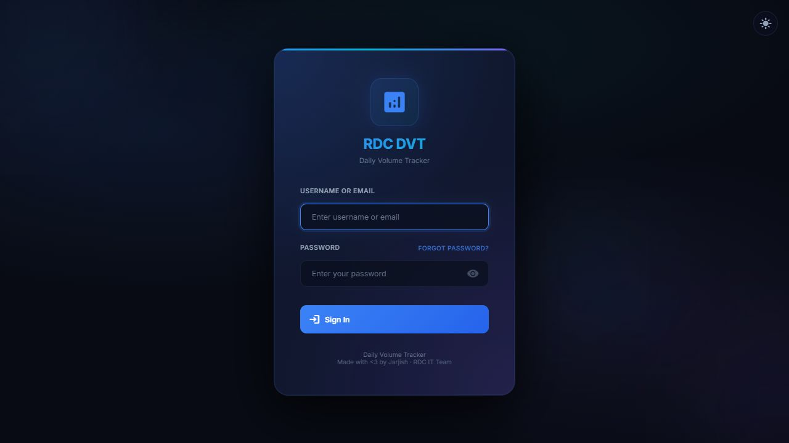
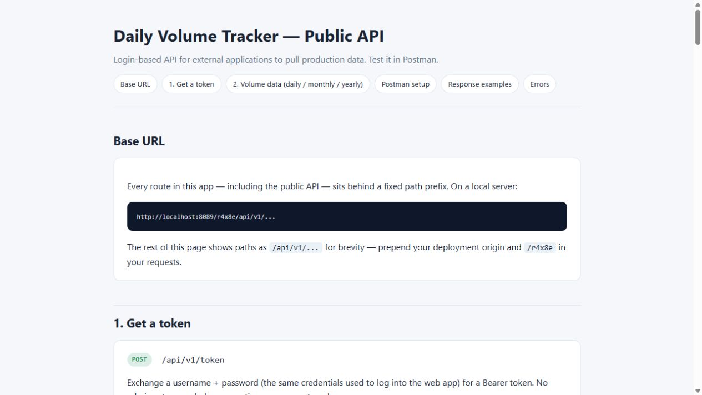

# RDC Daily Volume Tracker

[](https://github.com/jarjishSiddibapa/rdc-daily-volume-tracker/actions/workflows/ci.yml)
[](https://www.python.org/)
[](https://flask.palletsprojects.com/)

A Flask application for tracking ready-mix concrete production volumes across plants and regions. It combines manual volume entry with Oracle ERP synchronization, dashboards, analytics, Excel exports, user access controls, email alerts, and scheduled MySQL backups.

## Product tour

The application uses a focused, dark-mode-first interface with an optional light theme. These screenshots are from the local application and contain no production data.

| Authentication | Public API reference |
| --- | --- |
|  |  |

## Features

- Daily, monthly, and yearly production reporting
- Oracle ERP production and invoicing synchronization
- Plant, region, target, employee, and user management
- Role-based access control and audit logging
- Excel import/export workflows
- Zero-volume alerts and scheduled daily-report emails
- Token-authenticated API endpoints
- Configurable scheduled MySQL backups

## Requirements

- Python 3.11 or newer
- MySQL 8 or newer
- Oracle database access for ERP synchronization
- Oracle Instant Client only when using `python-oracledb` thick mode

## Quick start on Windows

1. Clone the repository and enter the project directory:

   ```powershell
   git clone https://github.com/jarjishSiddibapa/rdc-daily-volume-tracker.git
   cd rdc-daily-volume-tracker
   ```

2. Create a virtual environment and install dependencies:

   ```powershell
   python -m venv venv
   .\venv\Scripts\Activate.ps1
   python -m pip install --upgrade pip
   pip install -r requirements.txt
   ```

3. Create the MySQL database:

   ```sql
   CREATE DATABASE daily_volume_tracker
     CHARACTER SET utf8mb4
     COLLATE utf8mb4_unicode_ci;
   ```

4. Copy the environment template and fill in your own credentials:

   ```powershell
   Copy-Item .env.example .env
   python -c "import secrets; print(secrets.token_hex(32))"
   ```

   Put the generated value in `FLASK_SECRET_KEY`. Set the MySQL values and, if ERP synchronization is required, the Oracle values. Never commit `.env`.

5. Start the development server:

   ```powershell
   python run.py
   ```

   Open `http://localhost:8089/r4x8e/`. On the first run, sign in as `admin` using `ADMIN_INITIAL_PASSWORD`. Change that password immediately.

## Production-style local server

The included Waitress entry point listens on port `8089`:

```powershell
python server.py
```

On Windows, double-click `start-all.bat` to launch the production-style server. The launcher always switches to the repository directory, verifies `.env`, creates `venv` when needed, installs missing dependencies, starts `server.py`, and writes launcher output to `Logs/launcher.log`. The older `start_app.bat` remains as a compatible alias.

For Windows Task Scheduler, set **Program/script** to the absolute path of `start-all.bat`. The script handles its working directory, so **Start in** is optional. Configure the task to run whether the user is logged on or not and choose **Do not start a new instance** if the task is already running. The task remains active while Waitress and the optional in-process scheduler are running.

For an internet-facing deployment, place the app behind an HTTPS reverse proxy and set `SESSION_COOKIE_SECURE=true`.

The defaults are intentionally conservative for a server that hosts multiple applications: four Waitress threads, a five-connection SQLAlchemy pool, no per-request access-log writes, and a 10-second bounded report cache. Tune these values only after measuring concurrent usage.

## Configuration

All runtime configuration is read from `.env`.

| Variable | Purpose |
| --- | --- |
| `FLASK_SECRET_KEY` | Stable secret used to sign sessions |
| `SESSION_COOKIE_SECURE` | Set to `true` behind HTTPS |
| `MYSQL_USER`, `MYSQL_PASSWORD` | MySQL credentials |
| `MYSQL_HOST`, `MYSQL_PORT`, `MYSQL_DB` | MySQL connection settings |
| `ORACLE_USER`, `ORACLE_PASSWORD` | Read-only Oracle ERP credentials |
| `ORACLE_HOST`, `ORACLE_PORT`, `ORACLE_SERVICE` | Oracle ERP connection settings |
| `ORACLE_CLIENT_PATH` | Optional Instant Client path for thick mode |
| `ADMIN_INITIAL_PASSWORD` | Initial password used only when seeding the first admin |
| `APP_HOST`, `APP_PORT` | Waitress bind address and port |
| `WAITRESS_THREADS` | Request worker threads; defaults to `4` |
| `DB_POOL_SIZE`, `DB_MAX_OVERFLOW` | Bounded MySQL connection pool limits |
| `DB_POOL_RECYCLE_SECONDS`, `DB_POOL_TIMEOUT_SECONDS` | MySQL connection health settings |
| `REPORT_CACHE_SECONDS` | Short in-process cache for repeated report requests |
| `SCHEDULER_ENABLED` | Enables the email, ERP, and backup scheduler in this process |
| `LOG_ALL_REQUESTS`, `SLOW_REQUEST_MS` | Optional access logging and slow-request threshold |
| `HEARTBEAT_ENABLED` | Enables the optional hourly heartbeat thread |

Email and backup schedules are configured from the application's admin pages after startup.

## Project structure

```text
app/
  routes/       Flask blueprints for pages and APIs
  services/     ERP sync, analytics, reporting, email, audit, and backups
  static/       CSS and browser-side JavaScript
  templates/    Jinja templates
run.py          Development entry point
server.py       Waitress entry point with rotating request logs
```

The detailed REST API reference is available in [`API_DOCUMENTATION.html`](API_DOCUMENTATION.html).

## Documentation map

- [Architecture](docs/ARCHITECTURE.md) — components, data flow, and scheduled jobs
- [Deployment guide](docs/DEPLOYMENT.md) — local, production-style, and HTTPS deployment
- [User guide](docs/USER_GUIDE.md) — day-to-day workflows for operators and administrators
- [Operations runbook](docs/OPERATIONS.md) — backups, syncs, alerts, and troubleshooting
- [Contributing](CONTRIBUTING.md) — development workflow and validation checks
- [Security policy](SECURITY.md) — vulnerability reporting and deployment safeguards
- [API reference](API_DOCUMENTATION.html) — token flow and read-only volume endpoints

## Access model

| Role | Access |
| --- | --- |
| `admin` | Full application and configuration access |
| `manual_entry` | Manual volume entry; optional target and employee-detail permissions |
| `viewer` | Read-only dashboards and reports |

All external API endpoints are read-only and use short-lived Bearer tokens. Web sessions use Flask-Login and an inactivity timeout.

## Architecture at a glance

```text
Browser / API client
        │
        ▼
Prefix middleware (/r4x8e)
        │
        ├── Flask routes ── services ── MySQL
        │                         ├── Oracle ERP (read-only sync)
        │                         ├── SMTP (alerts/reports)
        │                         └── database-backup/ (local SQL exports)
        └── APScheduler (email, ERP sync, backup checks)
```

See the [architecture guide](docs/ARCHITECTURE.md) for the detailed request and data flows.

## Performance approach

- Static CSS, JavaScript, and the favicon use content-versioned URLs and one-year browser caching.
- HTML, JSON, CSS, JavaScript, and SVG responses use low-CPU gzip compression.
- Flatpickr loads only on the four pages that use a date or month picker.
- Dashboard and report requests share a small, invalidated, 10-second in-process cache.
- Navigation and API actions show immediate progress and button feedback without continuous animation work.
- The application stays on Flask. The rationale and migration threshold are documented in [ADR 0001](docs/adr/0001-retain-flask-optimize-runtime.md).

## Security notes

- Local credentials, logs, database backups, reports, Oracle binaries, and generated analysis are excluded by `.gitignore`.
- Use a read-only Oracle account with only the permissions required by the reporting queries.
- Keep `FLASK_SECRET_KEY` stable between restarts and rotate any credential that may have been exposed.
- Restrict the application at the network or reverse-proxy layer; the URL prefix is not an authentication boundary.

## Validation

Run a syntax check before committing changes:

```powershell
python -m compileall -q app run.py server.py
```

Pull requests should also pass `pip check` and keep credentials, exports, database dumps, and generated files out of Git. See [CONTRIBUTING.md](CONTRIBUTING.md).
